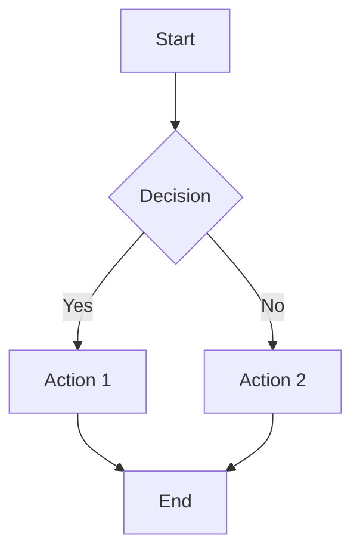

---
# REQUIRED METADATA
# Title of the article (max ~60 chars)
title: "Your Article Title"
# Optional: URL slug (if omitted, derived from filename)
slug: "your-slug"
# Short description used for SEO (max 160 chars)
description: "One-sentence summary for SEO."
# Publication date (YYYY-MM-DD or ISO)
date: "2025-01-01"
# Single category for this article
category: "category-name"
# Keywords (non-unique, for SEO)
keywords:
  - keyword-one
  - keyword-two
# Optional: feature/cover image (path under public/ or absolute URL)
coverImage: "/blog-images/your-image.jpg"
coverAlt: "Accessible description for the cover image"
# Set to true to exclude from build
draft: false
---

# Heading 1 (auto-rendered as Article H1)

Intro paragraph.

## Heading 2

Your content here. You can embed images from subfolders:


You can also create mermaid diagrams:



- Lists
- Code

```python
def hello_world():
    print("Hello, World!")
    return "success"
```

```c
#include <stdio.h>

int main() {
    printf("Hello, World!\n");
    return 0;
}
```

```javascript
function greet(name) {
    console.log(`Hello, ${name}!`);
}
```
