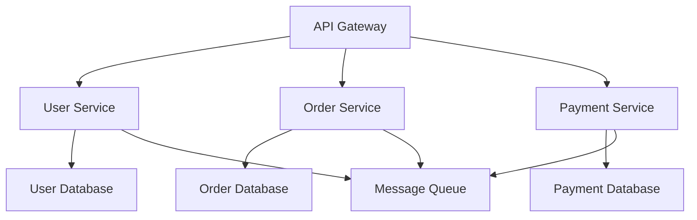
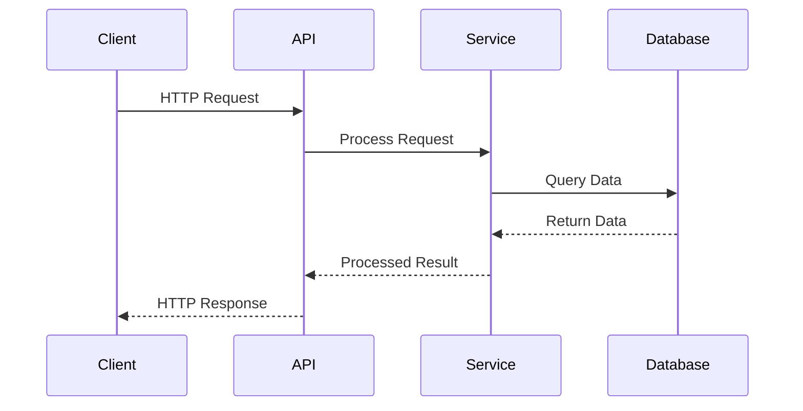

# System Architecture Patterns

Understanding system architecture through visual diagrams and practical examples.

## Microservices Architecture



## Data Flow in Reactive Systems

```python
# Python example of reactive data processing
import asyncio
from typing import AsyncIterator

async def data_processor(stream: AsyncIterator[dict]) -> AsyncIterator[dict]:
    async for item in stream:
        # Process the data
        processed = {
            'id': item['id'],
            'value': item['value'] * 2,
            'timestamp': time.now()
        }
        yield processed

# Usage
async def main():
    async for result in data_processor(input_stream):
        print(f"Processed: {result}")
```

## Component Communication



## Code Organization

```javascript
// JavaScript module pattern
class UserService {
  constructor(database, logger) {
    this.db = database;
    this.logger = logger;
  }
  
  async createUser(userData) {
    try {
      const user = await this.db.users.create(userData);
      this.logger.info(`User created: ${user.id}`);
      return user;
    } catch (error) {
      this.logger.error(`Failed to create user: ${error.message}`);
      throw error;
    }
  }
}
```

This architectural thinking helps us build maintainable and scalable systems.